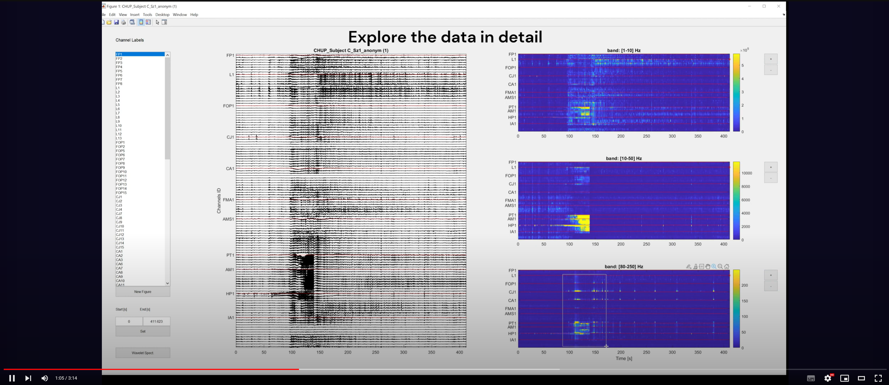

# PowerMapp

## App to analyse sEEG data

PowerMapp was developed to analyse multi-channel recordings of sEEG data, but can apply to other multi-channel recording modalities. It is focused on the frequency domain analysis, specifically power-bands and wavelet transforms.
Developed in Matlab

How to use demo:

For questions, suggestions, and bug reports send an email to domingos.castro@i3s.up.pt

THIS SOFTWARE IS PROVIDED "AS IS", WITHOUT WARRANTY OF ANY KIND, EXPRESS OR IMPLIED, INCLUDING BUT NOT LIMITED TO THE WARRANTIES OF MERCHANTABILITY, FITNESS FOR A PARTICULAR PURPOSE AND NONINFRINGEMENT. IN NO EVENT SHALL THE AUTHORS OR COPYRIGHT HOLDERS BE LIABLE FOR ANY CLAIM, DAMAGES OR OTHER LIABILITY, WHETHER IN AN ACTION OF CONTRACT, TORT OR OTHERWISE, ARISING FROM, OUT OF OR IN CONNECTION WITH THE SOFTWARE OR THE USE OR OTHER DEALINGS IN THE SOFTWARE.
